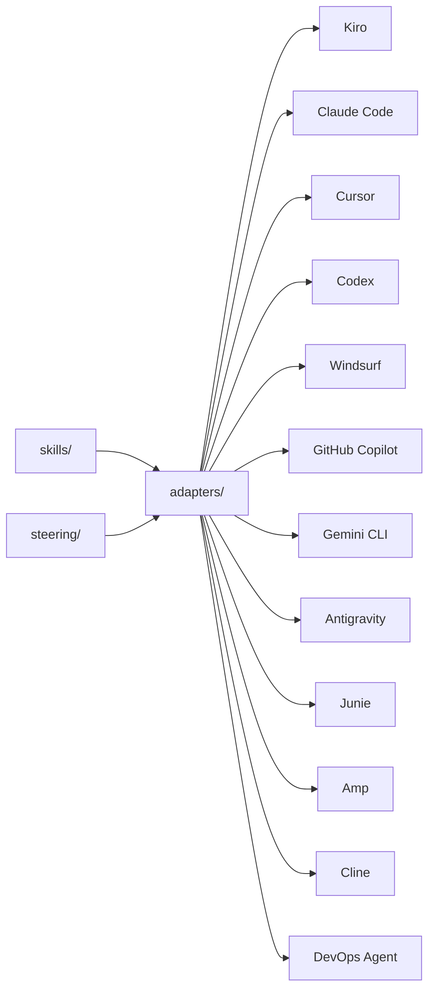

# 🏗️ Well-Architected Skills & Steering for AI Coding Agents

Reusable skills and steering that teach AI coding agents how to apply the [AWS Well-Architected Framework](https://docs.aws.amazon.com/wellarchitected/latest/framework/welcome.html). One set of playbooks, **12 supported tools**.

<div align="center">

**Kiro** · **Claude Code** · **Cursor** · **Codex** · **Windsurf** · **GitHub Copilot** · **Gemini CLI** · **Antigravity** · **Junie** · **Amp** · **Cline** · **AWS DevOps Agent**

</div>

> [!IMPORTANT]
> This sample is provided for educational and demonstrative purposes. It is not intended for production use without additional review and testing appropriate to your environment.

---

## 🎯 Why this exists

Developers don't stop to consult documentation — they ask their AI assistant. If the assistant doesn't know the Well-Architected Framework, the guidance never reaches the code.

This project embeds WA best practices **where development actually happens**: in the IDE, at the moment code is being written. Instead of treating architecture reviews as a separate gate, teams get continuous, contextual guidance that:

- ✅ Reduces rework by catching misalignments early
- ✅ Works across 12 AI coding tools with a single source of truth
- ✅ Requires no AWS credentials, no API calls — everything runs locally
- ✅ Follows the open [Agent Skills specification](https://agentskills.io/)

---

## 📦 What's inside

```text
steering/                           Always-on context (Kiro)
  well-architected.md                 Pillars, design principles, review process

skills/                             Step-by-step playbooks (tool-agnostic)
  wa-review/                          Full review across all 6 pillars
  security-assessment/                IAM, detection, data protection, incident response
  reliability-improvement-plan/       SPOFs, recovery, scaling, change management
  cost-optimization-audit/            Waste, right-sizing, pricing models
  performance-efficiency/             Resource selection, scaling, caching
  sustainability-optimization/        Utilization, managed services, data lifecycle
  operational-excellence/             CI/CD, observability, incidents, automation
  migration-readiness/                7 Rs assessment with migration plan
  architecture-decision-record/       WA-aligned ADRs with pillar impact

assets/                             Shared reference material
  v13/                                307 WA Framework best practices (by ID)
  well-architected-best-practices.md  Per-pillar investigation checklists
  cloudwatch-metrics-reference.md     Metric thresholds + composite alarm patterns
  incident-investigation-patterns.md  Triage, RCA, mitigation playbooks
  skill-authoring-guide.md            DevOps Agent skill authoring guide

adapters/                           Tool-specific configuration
  claude-code/                        CLAUDE.md + slash commands
  cursor/                             .cursor/rules/*.md
  codex/                              AGENTS.md
  windsurf/                           .windsurfrules
  github-copilot/                     .github/copilot-instructions.md
  cline/                              .clinerules
  gemini-cli/                         GEMINI.md
  antigravity/                        .agents/rules/*.md
  junie/                              .junie/guidelines + .junie/skills
  amp/                                .agents/skills/*.md
  devops-agent/                       Packaging for AWS DevOps Agent

install.sh                          One-command setup (macOS/Linux)
install.ps1                         One-command setup (Windows PowerShell)
```

---

## 🚀 Quick start

### One-liner (no clone needed)

**macOS / Linux:**

```bash
curl -sL https://raw.githubusercontent.com/aws-samples/sample-well-architected-skills-and-steering/main/bootstrap.sh | bash -s -- --tool claude-code ~/my-project
```

**Windows (PowerShell):**

```powershell
& ([scriptblock]::Create((irm https://raw.githubusercontent.com/aws-samples/sample-well-architected-skills-and-steering/main/bootstrap.ps1))) -Tool claude-code -TargetDir .\my-project
```

Downloads the repo to a temp directory, runs the installer, and cleans up. All flags work (`--tool`, `--symlink`, `--global`, `--force`).

### Install script (from local clone)

```bash
# Install for a specific tool
./install.sh ~/my-project --tool claude-code
./install.sh ~/my-project --tool cursor
./install.sh ~/my-project --tool kiro

# Install for multiple tools at once
./install.sh ~/my-project --tool kiro --tool claude-code --tool cursor

# Install for all supported tools
./install.sh ~/my-project --tool all

# Use symlinks for automatic updates
./install.sh ~/my-project --tool claude-code --symlink

# Install globally (applies to all projects)
./install.sh --global --tool claude-code
```

Run `./install.sh --help` for full usage.

**Windows (PowerShell):**

```powershell
.\install.ps1 -TargetDir C:\Projects\my-app -Tool claude-code
.\install.ps1 -Tool all -Force
```

> [!TIP]
> Use `--symlink` (bash) or `-Symlink` (PowerShell) to create symbolic links instead of copies. When this repo updates, your project gets the changes automatically without reinstalling. On Windows, symlinks require elevated permissions.

> [!NOTE]
> **Global installs** place files in your home directory (`~/CLAUDE.md`, `~/.kiro/`, `~/.cursor/`, etc.) and apply to all projects without their own config. Use project-level installation (the default) if you only want WA guidance for specific projects.
>
> **Existing files** — the installer prompts before overwriting. Use `--force` to skip confirmation.

---

### Manual installation

<details>
<summary><strong>🔹 Kiro</strong></summary>

```bash
mkdir -p .kiro/steering .kiro/skills
cp path/to/this-repo/steering/well-architected.md .kiro/steering/
cp -r path/to/this-repo/skills/* .kiro/skills/
```

</details>

<details>
<summary><strong>🔹 Claude Code</strong></summary>

```bash
cp path/to/this-repo/adapters/claude-code/CLAUDE.md ./CLAUDE.md
cp -r path/to/this-repo/adapters/claude-code/commands .claude/commands
```

</details>

<details>
<summary><strong>🔹 Cursor</strong></summary>

```bash
cp -r path/to/this-repo/adapters/cursor/rules .cursor/rules
```

</details>

<details>
<summary><strong>🔹 Codex (OpenAI)</strong></summary>

```bash
cp path/to/this-repo/adapters/codex/AGENTS.md ./AGENTS.md
cp -r path/to/this-repo/skills ./skills
```

</details>

<details>
<summary><strong>🔹 Windsurf</strong></summary>

```bash
cp path/to/this-repo/adapters/windsurf/.windsurfrules ./.windsurfrules
```

</details>

<details>
<summary><strong>🔹 GitHub Copilot</strong></summary>

```bash
mkdir -p .github
cp path/to/this-repo/adapters/github-copilot/.github/copilot-instructions.md .github/
```

</details>

<details>
<summary><strong>🔹 Gemini CLI</strong></summary>

```bash
cp path/to/this-repo/adapters/gemini-cli/GEMINI.md ./GEMINI.md
cp -r path/to/this-repo/skills ./skills
```

</details>

<details>
<summary><strong>🔹 Antigravity</strong></summary>

```bash
mkdir -p .agents/rules .agents/skills
cp -r path/to/this-repo/adapters/antigravity/rules/* .agents/rules/
for skill_dir in path/to/this-repo/skills/*/; do
  skill_name=$(basename "$skill_dir")
  mkdir -p ".agents/skills/$skill_name"
  cp "$skill_dir/SKILL.md" ".agents/skills/$skill_name/SKILL.md"
done
```

</details>

<details>
<summary><strong>🔹 Junie (JetBrains)</strong></summary>

```bash
mkdir -p .junie/guidelines .junie/skills
cp path/to/this-repo/adapters/junie/guidelines.md .junie/guidelines/well-architected.md
cp -r path/to/this-repo/skills/* .junie/skills/
```

</details>

<details>
<summary><strong>🔹 Amp</strong></summary>

```bash
cp path/to/this-repo/adapters/amp/AGENTS.md ./AGENTS.md
mkdir -p .agents/skills
cp -r path/to/this-repo/skills/* .agents/skills/
```

</details>

<details>
<summary><strong>🔹 Cline</strong></summary>

```bash
cp path/to/this-repo/adapters/cline/.clinerules ./.clinerules
```

</details>

<details>
<summary><strong>🔹 AWS DevOps Agent</strong></summary>

```bash
# Package all skills as zip files for upload to your Agent Space
./install.sh ~/output-dir --tool devops-agent
# Then upload each .zip from ~/output-dir/devops-agent-skills/ via the Operator Web App
```

</details>

---

## ⚙️ How it works



| Component | What it does |
| --------- | ------------ |
| **Skills** (`skills/*/SKILL.md`) | Self-contained, tool-agnostic playbooks. Any AI agent can follow them step-by-step. They don't depend on steering or on each other. |
| **Steering** (`steering/*.md`) | Always-on context loaded into every Kiro conversation. Other tools use equivalent mechanisms via adapters. |
| **Adapters** (`adapters/`) | Translate steering into each tool's native config format and wire up skills as commands or rules. |
| **Assets** (`assets/`) | Shared reference material (v13 best practices, metrics, patterns) bundled with skills for tools that support it. |

### Tool compatibility matrix

| Tool | Steering mechanism | Skills mechanism |
| ---- | ------------------ | ---------------- |
| Kiro | `.kiro/steering/*.md` | `.kiro/skills/*/SKILL.md` |
| Claude Code | `CLAUDE.md` | `.claude/commands/*.md` (slash commands) |
| Cursor | `.cursor/rules/*.md` | Rules with conditional activation |
| Codex | `AGENTS.md` | References `skills/` directory |
| Windsurf | `.windsurfrules` | References `skills/` directory |
| GitHub Copilot | `.github/copilot-instructions.md` | Inline (no separate skill mechanism) |
| Cline | `.clinerules` | References `skills/` directory |
| Gemini CLI | `GEMINI.md` | References `skills/` directory |
| Antigravity | `.agents/rules/*.md` | `.agents/skills/*/SKILL.md` |
| Junie | `.junie/guidelines/*.md` | `.junie/skills/*/SKILL.md` |
| Amp | `AGENTS.md` | `.agents/skills/*/SKILL.md` |
| AWS DevOps Agent | N/A (skills are self-contained) | `SKILL.md` zip upload to Agent Space |

---

## 📋 Skills overview

| Skill | Pillar(s) | Use when you need to... |
| ----- | --------- | ----------------------- |
| `wa-review` | All 6 | Run a full Well-Architected review |
| `security-assessment` | 🔒 Security | Assess IAM, detection, data protection, incident response |
| `reliability-improvement-plan` | 🔄 Reliability | Find and eliminate single points of failure |
| `cost-optimization-audit` | 💰 Cost Optimization | Identify waste and right-sizing opportunities |
| `performance-efficiency` | ⚡ Performance Efficiency | Evaluate resource selection, scaling, and caching |
| `sustainability-optimization` | 🌱 Sustainability | Reduce carbon footprint and resource waste |
| `operational-excellence` | 🛠️ Operational Excellence | Assess CI/CD, observability, incident management |
| `migration-readiness` | All 6 | Assess readiness to migrate a workload to AWS |
| `architecture-decision-record` | All 6 | Document a design decision with WA pillar impact |

---

## ✅ Verifying it works

Ask your AI coding agent:

```text
What Well-Architected pillars should I consider for this architecture?
```

If configured correctly, it will reference all six pillars with specific guidance rather than giving a generic answer.

> [!TIP]
> **Claude Code users**: try `/wa-review` to invoke the full review skill as a slash command.
>
> **Kiro users**: the steering loads automatically — just start discussing architecture and the agent applies WA principles.

---

## 🧪 Evaluating skills

Each skill includes structured evaluations in `skills/*/evals/evals.json` following the [Agent Skills eval spec](https://agentskills.io/skill-creation/evaluating-skills). Evals let you measure whether the skills produce better outputs than a bare agent.

Each test case includes:
- A realistic user prompt
- Expected output description
- 5-7 concrete assertions (gradable as PASS/FAIL)

To run evals, execute each prompt **with** and **without** the skill loaded, then grade the assertions against the outputs. See the spec for the full workflow including grading, benchmarking, and iteration.

> [!TIP]
> Start by running a single eval manually. Compare the with-skill and without-skill outputs side by side — the difference in structure and specificity is usually immediately obvious.

---

## 🤝 Contributing

We welcome contributions from the community and internal teams alike! See [CONTRIBUTING.md](CONTRIBUTING.md) for guidelines on adding skills, modifying steering files, or adding new tool adapters.

> [!NOTE]
> This is a community-driven project. Anyone can collaborate and improve the skills and steering docs through Pull Requests. Adapt them to your domain, add new patterns, and share back.

---

## 🔒 Security

See [CONTRIBUTING](CONTRIBUTING.md#security-issue-notifications) for more information.

---

## 📄 License

This project is licensed under the [MIT-0 License](LICENSE).

---

## 📚 Related Resources

- [AWS Well-Architected Framework](https://docs.aws.amazon.com/wellarchitected/latest/framework/welcome.html)
- [AWS Well-Architected Tool](https://aws.amazon.com/well-architected-tool/)
- [Kiro — AI-powered IDE](https://kiro.dev)
- [AWS DevOps Agent](https://docs.aws.amazon.com/devopsagent/latest/userguide/)
- [Agent Skills Specification](https://agentskills.io/)
