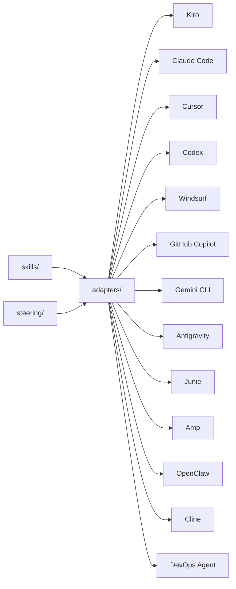

# 🏗️ Well-Architected Skills & Steering for AI Coding Agents

Reusable skills and steering that teach AI coding agents how to apply the [AWS Well-Architected Framework](https://docs.aws.amazon.com/wellarchitected/latest/framework/welcome.html). One set of playbooks, **13 supported tools**.

<div align="center">

**Kiro** · **Kiro CLI** · **Claude Code** · **Cursor** · **Codex** · **Windsurf** · **GitHub Copilot** · **Gemini CLI** · **Antigravity** · **Junie** · **Amp** · **OpenClaw** · **Cline** · **AWS DevOps Agent**

</div>

> [!IMPORTANT]
> This sample is provided for educational and demonstrative purposes. It is not intended for production use without additional review and testing appropriate to your environment.

---

## 🎯 Why this exists

Developers don't stop to consult documentation — they ask their AI assistant. If the assistant doesn't know the Well-Architected Framework, the guidance never reaches the code.

This project embeds WA best practices **where development actually happens**: in the IDE, at the moment code is being written. Instead of treating architecture reviews as a separate gate, teams get continuous, contextual guidance that:

- ✅ Reduces rework by catching misalignments early
- ✅ Works across 13 AI coding tools with a single source of truth
- ✅ Requires no AWS credentials, no API calls — everything runs locally
- ✅ Follows the open [Agent Skills specification](https://agentskills.io/)

---

## 📦 What's inside

```text
steering/                           Always-on context (Kiro)
  well-architected.md                 Pillars, design principles, review process
  wa-review.md                        Deep multi-step WA review (evidence-based, constrained)

skills/                             Step-by-step playbooks (tool-agnostic)
  wa-review/                          Full review across all 6 pillars
    references/questions/               57 per-question BP-level reference files (307 BPs)
    references/lenses/                  Lens-specific references (serverless, gen AI, agentic, etc.)
  security-assessment/                IAM, detection, data protection, incident response
  reliability-improvement-plan/       SPOFs, recovery, scaling, change management
  cost-optimization-review/            Waste, right-sizing, pricing models
  performance-efficiency/             Resource selection, scaling, caching
  sustainability-optimization/        Utilization, managed services, data lifecycle
  operational-excellence/             CI/CD, observability, incidents, automation
  migration-readiness/                7 Rs assessment with migration plan
  architecture-decision-record/       WA-aligned ADRs with pillar impact
  wa-builder/                         Learn WA + produce visual artifacts (diagrams, trees, roadmaps)
  wa-guardrails/                      Preventive controls (Config rules, SCPs, CI checks) for ongoing adherence to WA guidance

examples/                           Sample IaC with planted WA issues (for demos and eval fixtures)
  insecure-serverless-app-cdk/        CDK TypeScript — ~20 issues across all 6 pillars
  insecure-serverless-app-terraform/  Terraform — ~17 issues across all 6 pillars

assets/                             Shared reference material
  well-architected-best-practices.md  Per-pillar investigation checklists
  cloudwatch-metrics-reference.md     Metric thresholds + composite alarm patterns
  incident-investigation-patterns.md  Triage, RCA, mitigation playbooks
  skill-authoring-guide.md            DevOps Agent skill authoring guide

scripts/                            Maintenance tooling
  crawl-wa-framework.py               Crawl AWS docs to regenerate reference files

adapters/                           Tool-specific configuration
  claude-code/                        CLAUDE.md + slash commands
  cursor/                             .cursor/rules/*.md
  codex/                              AGENTS.md
  windsurf/                           .windsurfrules
  github-copilot/                     .github/copilot-instructions.md
  cline/                              .clinerules
  gemini-cli/                         GEMINI.md
  antigravity/                        .agents/rules/*.md
  junie/                              .junie/guidelines + .junie/skills
  amp/                                .agents/skills/*.md
  openclaw/                           AGENTS.md + .agents/skills/*.md
  devops-agent/                       Packaging for AWS DevOps Agent

powers/                             Kiro Powers
  wa-review/                          Full WA review with auto-activation and progressive references

evals/                              Automated evaluation runner (Bedrock)
  run.py                              CLI entry point
  grade.py                            LLM-as-judge grader
  report.py                           Scoring and terminal output
  config.yaml                         Bedrock region and model config
  benchmark.py                        Multi-model comparison runner
  benchmark_report.py                 Generate markdown tables from benchmark results
  benchmark_config.yaml               Models, prompt, and grading criteria
  pyproject.toml                      Dependencies (use uv sync)

install.sh                          One-command setup (macOS/Linux)
install.ps1                         One-command setup (Windows PowerShell)
```

---

## 🚀 Quick start

### One-liner (no clone needed)

#### Via [skills.sh](https://skills.sh)

```bash
npx skills add aws-samples/sample-well-architected-skills-and-steering
```

Auto-detects your AI agent and installs skills directly. Use `--list` to preview available skills, or `--skill <name>` to install a specific one:

```bash
# List available skills
npx skills add aws-samples/sample-well-architected-skills-and-steering --list

# Install a specific skill
npx skills add aws-samples/sample-well-architected-skills-and-steering --skill wa-review

# Install globally (user-level, applies to all projects)
npx skills add aws-samples/sample-well-architected-skills-and-steering -g
```

#### Via bootstrap script

**macOS / Linux:**

```bash
curl -sL https://raw.githubusercontent.com/aws-samples/sample-well-architected-skills-and-steering/main/bootstrap.sh | bash
```

**Windows (PowerShell):**

```powershell
& ([scriptblock]::Create((irm https://raw.githubusercontent.com/aws-samples/sample-well-architected-skills-and-steering/main/bootstrap.ps1)))
```

Auto-detects your AI tools (`.cursor/`, `.claude/`, `.kiro/`, `.junie/`, `.openclaw/`, etc.), installs for all of them, and cleans up.

To install for a specific tool instead:

```bash
# macOS / Linux
curl -sL .../bootstrap.sh | bash -s -- --tool kiro

# Windows (PowerShell)
& ([scriptblock]::Create((irm .../bootstrap.ps1))) -Tool kiro
```

### Install script (from local clone)

**macOS / Linux:**

```bash
# Auto-detect tools in your project
./install.sh ~/my-project --tool auto

# Install for a specific tool
./install.sh ~/my-project --tool claude-code

# Install for multiple tools at once
./install.sh ~/my-project --tool kiro --tool claude-code --tool cursor

# Install for all supported tools
./install.sh ~/my-project --tool all

# Use symlinks for automatic updates
./install.sh ~/my-project --tool claude-code --symlink

# Install globally (applies to all projects)
./install.sh --global --tool claude-code
```

**Windows (PowerShell):**

```powershell
# Auto-detect tools in your project
.\install.ps1 -TargetDir C:\Projects\my-app -Tool auto

# Install for a specific tool
.\install.ps1 -TargetDir C:\Projects\my-app -Tool claude-code

# Install for multiple tools at once
.\install.ps1 -Tool kiro, claude-code, cursor

# Install for all supported tools
.\install.ps1 -Tool all -Force

# Install globally (applies to all projects)
.\install.ps1 -Global -Tool claude-code
```

> [!TIP]
> Use `--symlink` (bash) or `-Symlink` (PowerShell) to create symbolic links instead of copies. When this repo updates, your project gets the changes automatically without reinstalling. On Windows, symlinks require elevated permissions.

> [!NOTE]
> **Global installs** place files in your home directory (`~/CLAUDE.md`, `~/.kiro/`, `~/.cursor/`, etc.) and apply to all projects without their own config. Use project-level installation (the default) if you only want WA guidance for specific projects.
>
> **Existing files** — the installer prompts before overwriting. Use `--force` to skip confirmation.

---

### Manual installation

<details>
<summary><strong>🔹 Kiro</strong></summary>

macOS / Linux:

```bash
mkdir -p .kiro/steering .kiro/skills
cp path/to/this-repo/steering/well-architected.md .kiro/steering/
cp -r path/to/this-repo/skills/* .kiro/skills/
```

Windows (PowerShell):

```powershell
New-Item -ItemType Directory -Force -Path .kiro\steering, .kiro\skills
Copy-Item path\to\this-repo\steering\well-architected.md .kiro\steering\
Copy-Item -Recurse path\to\this-repo\skills\* .kiro\skills\
```

</details>

<details>
<summary><strong>🔹 Kiro Power (recommended for Kiro users)</strong></summary>

The Kiro Power bundles the wa-review skill + steering + all reference material into a single installable unit with keyword-based auto-activation.

**Install from local clone:**

```bash
git clone https://github.com/aws-samples/sample-well-architected-skills-and-steering.git
```

Then in Kiro: Powers panel → **Add Custom Power** → **Import power from a folder** → select `powers/wa-review/`

**What you get:**

- Auto-activates when you mention "well-architected", "architecture review", "security review", "reliability", etc.
- Loads only relevant steering based on your current task
- Progressive BP-level reference loading (57 question files + 12 lens packs) — managed automatically

> [!NOTE]
> Kiro's "Import from GitHub" expects `POWER.md` at the repository root. Since this repo contains multiple skills and adapters, the Power lives under `powers/wa-review/` and must be imported from a local folder. If you want GitHub-based import, you can fork just the `powers/wa-review/` directory into its own repo.

</details>

<details>
<summary><strong>🔹 Claude Code</strong></summary>

macOS / Linux:

```bash
cp path/to/this-repo/adapters/claude-code/CLAUDE.md ./CLAUDE.md
cp -r path/to/this-repo/adapters/claude-code/commands .claude/commands
```

Windows (PowerShell):

```powershell
Copy-Item path\to\this-repo\adapters\claude-code\CLAUDE.md .\CLAUDE.md
Copy-Item -Recurse path\to\this-repo\adapters\claude-code\commands .claude\commands
```

</details>

<details>
<summary><strong>🔹 Cursor</strong></summary>

macOS / Linux:

```bash
cp -r path/to/this-repo/adapters/cursor/rules .cursor/rules
```

Windows (PowerShell):

```powershell
Copy-Item -Recurse path\to\this-repo\adapters\cursor\rules .cursor\rules
```

</details>

<details>
<summary><strong>🔹 Codex (OpenAI)</strong></summary>

macOS / Linux:

```bash
cp path/to/this-repo/adapters/codex/AGENTS.md ./AGENTS.md
cp -r path/to/this-repo/skills ./skills
```

Windows (PowerShell):

```powershell
Copy-Item path\to\this-repo\adapters\codex\AGENTS.md .\AGENTS.md
Copy-Item -Recurse path\to\this-repo\skills .\skills
```

</details>

<details>
<summary><strong>🔹 Windsurf</strong></summary>

macOS / Linux:

```bash
cp path/to/this-repo/adapters/windsurf/.windsurfrules ./.windsurfrules
```

Windows (PowerShell):

```powershell
Copy-Item path\to\this-repo\adapters\windsurf\.windsurfrules .\.windsurfrules
```

</details>

<details>
<summary><strong>🔹 GitHub Copilot</strong></summary>

macOS / Linux:

```bash
mkdir -p .github
cp path/to/this-repo/adapters/github-copilot/.github/copilot-instructions.md .github/
```

Windows (PowerShell):

```powershell
New-Item -ItemType Directory -Force -Path .github
Copy-Item path\to\this-repo\adapters\github-copilot\.github\copilot-instructions.md .github\
```

</details>

<details>
<summary><strong>🔹 Gemini CLI</strong></summary>

macOS / Linux:

```bash
cp path/to/this-repo/adapters/gemini-cli/GEMINI.md ./GEMINI.md
cp -r path/to/this-repo/skills ./skills
```

Windows (PowerShell):

```powershell
Copy-Item path\to\this-repo\adapters\gemini-cli\GEMINI.md .\GEMINI.md
Copy-Item -Recurse path\to\this-repo\skills .\skills
```

</details>

<details>
<summary><strong>🔹 Antigravity</strong></summary>

macOS / Linux:

```bash
mkdir -p .agents/rules .agents/skills
cp -r path/to/this-repo/adapters/antigravity/rules/* .agents/rules/
for skill_dir in path/to/this-repo/skills/*/; do
  skill_name=$(basename "$skill_dir")
  mkdir -p ".agents/skills/$skill_name"
  cp "$skill_dir/SKILL.md" ".agents/skills/$skill_name/SKILL.md"
done
```

Windows (PowerShell):

```powershell
New-Item -ItemType Directory -Force -Path .agents\rules, .agents\skills
Copy-Item -Recurse path\to\this-repo\adapters\antigravity\rules\* .agents\rules\
Get-ChildItem path\to\this-repo\skills -Directory | ForEach-Object {
    New-Item -ItemType Directory -Force -Path ".agents\skills\$($_.Name)"
    Copy-Item "$($_.FullName)\SKILL.md" ".agents\skills\$($_.Name)\SKILL.md"
}
```

</details>

<details>
<summary><strong>🔹 Junie (JetBrains)</strong></summary>

macOS / Linux:

```bash
mkdir -p .junie/guidelines .junie/skills
cp path/to/this-repo/adapters/junie/guidelines.md .junie/guidelines/well-architected.md
cp -r path/to/this-repo/skills/* .junie/skills/
```

Windows (PowerShell):

```powershell
New-Item -ItemType Directory -Force -Path .junie\guidelines, .junie\skills
Copy-Item path\to\this-repo\adapters\junie\guidelines.md .junie\guidelines\well-architected.md
Copy-Item -Recurse path\to\this-repo\skills\* .junie\skills\
```

</details>

<details>
<summary><strong>🔹 Amp</strong></summary>

macOS / Linux:

```bash
cp path/to/this-repo/adapters/amp/AGENTS.md ./AGENTS.md
mkdir -p .agents/skills
cp -r path/to/this-repo/skills/* .agents/skills/
```

Windows (PowerShell):

```powershell
Copy-Item path\to\this-repo\adapters\amp\AGENTS.md .\AGENTS.md
New-Item -ItemType Directory -Force -Path .agents\skills
Copy-Item -Recurse path\to\this-repo\skills\* .agents\skills\
```

</details>

<details>
<summary><strong>🔹 OpenClaw</strong></summary>

macOS / Linux:

```bash
cp path/to/this-repo/adapters/openclaw/AGENTS.md ./AGENTS.md
mkdir -p .agents/skills
cp -r path/to/this-repo/skills/* .agents/skills/
```

Windows (PowerShell):

```powershell
Copy-Item path\to\this-repo\adapters\openclaw\AGENTS.md .\AGENTS.md
New-Item -ItemType Directory -Force -Path .agents\skills
Copy-Item -Recurse path\to\this-repo\skills\* .agents\skills\
```

</details>

<details>
<summary><strong>🔹 Cline</strong></summary>

macOS / Linux:

```bash
cp path/to/this-repo/adapters/cline/.clinerules ./.clinerules
```

Windows (PowerShell):

```powershell
Copy-Item path\to\this-repo\adapters\cline\.clinerules .\.clinerules
```

</details>

<details>
<summary><strong>🔹 AWS DevOps Agent</strong></summary>

macOS / Linux:

```bash
# Package all skills as zip files for upload to your Agent Space
./install.sh ~/output-dir --tool devops-agent
# Then upload each .zip from ~/output-dir/devops-agent-skills/ via the Operator Web App
```

Windows (PowerShell):

```powershell
# Package all skills as zip files for upload to your Agent Space
.\install.ps1 -TargetDir C:\output-dir -Tool devops-agent
# Then upload each .zip from C:\output-dir\devops-agent-skills\ via the Operator Web App
```

</details>

---

## ⚙️ How it works



| Component | What it does |
| --------- | ------------ |
| **Skills** (`skills/*/SKILL.md`) | Self-contained, tool-agnostic playbooks. Any AI agent can follow them step-by-step. They don't depend on steering or on each other. |
| **Steering** (`steering/*.md`) | Always-on context loaded into every Kiro conversation. Other tools use equivalent mechanisms via adapters. |
| **Powers** (`powers/*/`) | Bundled, installable units for Kiro. Package steering + MCP tools + hooks into a single activatable power. |
| **Adapters** (`adapters/`) | Translate steering into each tool's native config format and wire up skills as commands or rules. |
| **Assets** (`assets/`) | Shared reference material (metrics, patterns, best practices) bundled with skills for tools that support it. |

### Tool compatibility matrix

| Tool | Steering mechanism | Skills mechanism |
| ---- | ------------------ | ---------------- |
| Kiro | `.kiro/steering/*.md` | `.kiro/skills/*/SKILL.md` |
| Claude Code | `CLAUDE.md` | `.claude/commands/*.md` (slash commands) |
| Cursor | `.cursor/rules/*.md` | Rules with conditional activation |
| Codex | `AGENTS.md` | References `skills/` directory |
| Windsurf | `.windsurfrules` | References `skills/` directory |
| GitHub Copilot | `.github/copilot-instructions.md` | Inline (no separate skill mechanism) |
| Cline | `.clinerules` | References `skills/` directory |
| Gemini CLI | `GEMINI.md` | References `skills/` directory |
| Antigravity | `.agents/rules/*.md` | `.agents/skills/*/SKILL.md` |
| Junie | `.junie/guidelines/*.md` | `.junie/skills/*/SKILL.md` |
| Amp | `AGENTS.md` | `.agents/skills/*/SKILL.md` |
| OpenClaw | `AGENTS.md` | `.agents/skills/*/SKILL.md` |
| AWS DevOps Agent | N/A (skills are self-contained) | `SKILL.md` zip upload to Agent Space |

---

## 📋 Skills overview

| Skill | Pillar(s) | Use when you need to... |
| ----- | --------- | ----------------------- |
| `wa-review` | All 6 | Run a full Well-Architected review |
| `security-assessment` | 🔒 Security | Assess IAM, detection, data protection, incident response |
| `reliability-improvement-plan` | 🔄 Reliability | Find and eliminate single points of failure |
| `cost-optimization-review` | 💰 Cost Optimization | Identify waste and right-sizing opportunities |
| `performance-efficiency` | ⚡ Performance Efficiency | Evaluate resource selection, scaling, and caching |
| `sustainability-optimization` | 🌱 Sustainability | Reduce carbon footprint and resource waste |
| `operational-excellence` | 🛠️ Operational Excellence | Assess CI/CD, observability, incident management |
| `migration-readiness` | All 6 | Assess readiness to migrate a workload to AWS |
| `architecture-decision-record` | All 6 | Document a design decision with WA pillar impact |
| `wa-builder` | All 6 | Learn WA for your project + produce visual artifacts (diagrams, decision trees, roadmaps) |
| `wa-guardrails` | All 6 | Generate preventive controls (Config rules, SCPs, CI checks, alarms) for ongoing adherence to WA guidance |

---

## 📊 Reference data and token consumption

The `wa-review` skill includes **307 best practices** across **57 framework questions** plus **12 lens extensions** — sourced directly from the [AWS Well-Architected public documentation](https://docs.aws.amazon.com/wellarchitected/latest/framework/welcome.html). This reference data lives in `skills/wa-review/references/` and is loaded progressively (one question at a time), not all at once.

### Reference data summary

| Content | Files | Size | Loaded when |
|---------|-------|------|-------------|
| Framework questions | 57 | 2.2 MB | Full review — one file per question evaluated |
| Serverless Lens | 6 | 120 KB | Workload uses Lambda/API Gateway/Step Functions |
| Generative AI Lens | 29 | 368 KB | LLM, RAG, or fine-tuning workloads |
| Agentic AI Lens | 41 | 1.2 MB | AI agent workloads |
| Responsible AI Lens | 28 | 780 KB | AI governance and fairness requirements |
| Hybrid Networking Lens | 30 | 480 KB | Direct Connect, VPN, Transit Gateway |
| Migration Lens | 6 | 76 KB | Migration planning |
| DevOps Guidance Lens | 196 | 820 KB | CI/CD, automated governance, dev lifecycle, observability |
| Machine Learning Lens | 35 | 852 KB | ML lifecycle (MLOPS), training/deployment, data engineering, responsible ML |
| Data Analytics Lens | 6 | 180 KB | Data pipelines, governance, catalogs, lineage, analytics perf & cost |
| Games Industry Lens | 32 | 316 KB | Game backends, real-time multiplayer, player data, live ops |
| SaaS Lens | 6 | 112 KB | Multi-tenancy, tenant isolation, onboarding, metering, tiering |
| Financial Services Lens | 79 | 432 KB | FSI compliance, data residency, resilience, auditability |

### Token strategies

A **full review** loading all 57 question files would consume ~500K–600K input tokens of reference material. Most models and tools have context limits far below that. Here are strategies to manage token consumption:

| Strategy | How | Best for |
|----------|-----|----------|
| **Quick review** | Ask for "quick review" — evaluates at question level without loading BP reference files | Fast feedback, budget-conscious |
| **Pillar-scoped** | Ask for specific pillars ("review security and reliability only") — loads only 11+13=24 question files | Targeted deep-dives |
| **Single-question** | Ask about a specific area ("how are we handling permissions?") — loads only SEC03.md | Focused investigation |
| **Lens-only** | Ask for just a lens review ("evaluate against the serverless lens") — skips core 57 questions | Domain-specific checks |
| **Progressive** | Start quick, then drill into flagged pillars | Balanced depth vs cost |

> [!TIP]
> **Recommended workflow for cost-effective reviews:**
> 1. Start with a **quick review** to identify which pillars have gaps
> 2. Then do a **pillar-scoped full review** on only the weak areas
> 3. Apply a **lens** if the workload type warrants it
>
> This typically loads 10–20 reference files (~100K tokens) instead of all 57+lens (~600K+).

> [!NOTE]
> **How the agent manages context:** The skill instructs the agent to work **sequentially** — load one question's reference file, evaluate it, write the finding, then move on. Reference files are not held in context simultaneously. The skill also supports a **two-pass approach**: a quick scan first to identify gaps, then deep-dives only on flagged questions (50–70% token reduction). See the `Context management strategy` section in [wa-review/SKILL.md](skills/wa-review/SKILL.md) for full details.

### Estimated costs

Token estimates assume ~4 characters per token. Costs use [Claude Opus 4 pricing](https://docs.anthropic.com/en/docs/about-claude/models#model-comparison-table) ($15/M input, $75/M output) as a reference — actual costs vary by model, provider, and whether you use caching. Pricing checked June 2026; verify current rates at the link above.

| Review type | Reference tokens loaded | Est. input cost | Est. total cost |
|-------------|------------------------|-----------------|-----------------|
| **Quick review** (no reference files) | ~5K (SKILL.md only) | < $0.01 | ~$0.50–$1.00 |
| **Full review, two-pass** (~20 gap files) | ~190K | ~$2.85 | ~$4–$7 |
| **Full review, all 57 questions** | ~550K | ~$8.25 | ~$10–$15 |
| **+ Serverless Lens** | +27K | +$0.40 | +$0.50–$1.00 |
| **+ Generative AI Lens** | +80K | +$1.20 | +$1.50–$3.00 |
| **+ Agentic AI Lens** | +294K | +$4.40 | +$5–$8 |

Total cost includes output tokens (the report itself, typically 8K–30K tokens depending on findings).

**Cost-saving tips:**
- Use the two-pass approach (default) — only loads files for questions with gaps
- Scope to specific pillars — e.g., "review security only" loads ~10 files instead of 57
- Use a smaller model for Pass 1 (quick scan) and a stronger model for Pass 2 (deep dive)
- Enable prompt caching if your provider supports it — the reference files are static and cache well

### Regenerating reference data

The reference files are committed to this repo and don't need regeneration unless the AWS docs update. To refresh:

```bash
# Regenerate all 57 framework question files
uv run scripts/crawl-wa-framework.py

# Regenerate a single pillar
uv run scripts/crawl-wa-framework.py --pillar security

# Add or refresh a lens
uv run scripts/crawl-wa-framework.py --lens https://docs.aws.amazon.com/wellarchitected/latest/serverless-applications-lens/welcome.html

# Lenses that use the dotted best-practice ID format (e.g. DevOps Guidance)
uv run scripts/crawl-wa-framework.py --lens https://docs.aws.amazon.com/wellarchitected/latest/devops-guidance/devops-guidance.html --lens-name devops-guidance
```

---

## ✅ Verifying it works

Ask your AI coding agent:

```text
What Well-Architected pillars should I consider for this architecture?
```

If configured correctly, it will reference all six pillars with specific guidance rather than giving a generic answer.

> [!TIP]
> **Claude Code users**: try `/wa-review` to invoke the full review skill as a slash command.
>
> **Kiro users**: the steering loads automatically — just start discussing architecture and the agent applies WA principles.

---

## 🧪 Evaluating skills

Each skill includes structured evaluations in `skills/*/evals/evals.json` following the [Agent Skills eval spec](https://agentskills.io/skill-creation/evaluating-skills). Evals let you measure whether the skills produce better outputs than a bare agent.

Each test case includes:

- A realistic user prompt
- Expected output description
- 5-7 concrete assertions (gradable as PASS/FAIL)

### Automated eval runner

The `evals/` directory contains an automated evaluation runner powered by **Amazon Bedrock**.

**Prerequisites:**

- Python 3.13+ and [uv](https://docs.astral.sh/uv/)
- AWS credentials configured with Bedrock access (`aws configure` or SSO)
- Bedrock model access enabled for the models in `evals/config.yaml` (Claude Opus 4.8 by default) in your region

**Setup:**

```bash
cd evals
uv sync
```

**Run evaluations:**

macOS / Linux / Windows (PowerShell):

```bash
# List available skills
uv run python run.py --list

# Evaluate a single skill
uv run python run.py --skill wa-review --verbose

# Evaluate all skills with parallel case execution
uv run python run.py --parallel --verbose

# Save results for historical tracking
uv run python run.py --parallel --save
```

> [!NOTE]
> On Windows, ensure your AWS credentials are configured via `aws configure` or environment variables (`AWS_ACCESS_KEY_ID`, `AWS_SECRET_ACCESS_KEY`, `AWS_SESSION_TOKEN`). If using AWS IAM Identity Center (SSO), run `aws sso login --profile your-profile` first.

**How it works:**

1. For each test case, generates two responses via Bedrock Converse API:
   - **Baseline** — prompt only, no skill context
   - **With skill** — prompt + SKILL.md injected as system context
2. An LLM-as-judge grades each assertion as PASS/FAIL against both outputs
3. Reports a score comparison showing the skill's impact

**Configuration** (`evals/config.yaml`):

```yaml
provider: bedrock
region: us-east-1
generation_model: us.anthropic.claude-opus-4-8
grading_model: us.anthropic.claude-opus-4-8
max_tokens: 16384
```

**Estimated cost per run:**

| Scope | Generation calls | Grading calls | Estimated cost |
| ----- | ---------------- | ------------- | -------------- |
| Single skill (3 cases) | 6 (Opus) | 6 (Opus) | ~$1.50 – $2.50 |
| All 11 skills (33 cases) | 66 (Opus) | 66 (Opus) | ~$15 – $25 |

Cost breakdown assumes ~1K input tokens and ~8K output tokens per generation call (16k max), and ~9K input / ~500 output per grading call. Actual cost depends on response length and Bedrock pricing in your region. Use `--parallel` for ~3x faster wall-clock time. You can use cheaper models (Sonnet, Haiku) by updating `config.yaml`.

> [!TIP]
> **Experiment with other models!** The eval runner works with any model available in Bedrock — try Amazon Nova, Meta Llama, Mistral, or others to see how different foundation models respond to skill guidance. Use the discovery utility to see what's available in your region:
>
> `uv run python list_models.py`
>
> Then update `generation_model` in `config.yaml` to try a different model. The grading model should remain a strong model (Claude Opus/Sonnet) for reliable assertion grading. Note: Opus 4.8 does not support the `temperature` parameter — the runner handles this automatically.

> [!TIP]
> Start by running a single skill eval (`--skill wa-review --verbose`) to see detailed per-assertion grading. The delta between baseline and with-skill scores quantifies the value each skill adds.

---

## 📈 Effectiveness

All skills are evaluated using an automated LLM-as-judge framework with paired comparison (same prompt, with and without skill context). Results with Claude Opus 4.8 (generation and grading), 16k token output:

| Skill | Baseline | With Skill | Delta |
|-------|----------|-----------|-------|
| `wa-review` | 82% | **100%** | +18% |
| `architecture-decision-record` | 81% | **100%** | +19% |
| `cost-optimization-review` | 93% | **100%** | +7% |
| `migration-readiness` | 85% | **100%** | +15% |
| `operational-excellence` | 90% | **100%** | +10% |
| `performance-efficiency` | 90% | **100%** | +10% |
| `reliability-improvement-plan` | 95% | **100%** | +5% |
| `security-assessment` | 94% | **100%** | +6% |
| `sustainability-optimization` | 85% | **100%** | +15% |
| `wa-builder` | 61% | **94%** | +33% |
| `wa-guardrails` | 76% | **99%** | +23% |
| **Average** | **85%** | **99%** | **+15%** |

- **9 of 11 skills** score 100% on behavioral assertions; `wa-builder` scores 94% and `wa-guardrails` 99%
- **Average +15% improvement** over the same model without skill guidance
- Skills never produce worse output than baseline — they improve or match

The evaluation framework is included in [`evals/`](./evals) so you can reproduce results on your own models and prompts. Use `--parallel` for ~3x faster runs.

---

## 🏎️ Model Benchmark

Compare how different foundation models perform on Well-Architected review tasks — measuring **quality**, **latency**, **throughput**, and **token cost** side by side.

<!-- BENCHMARK-START -->
### Model Benchmark Results

**Last run:** 2026-07-01T12:07:35Z | **Region:** us-east-1 | **Prompt:** 1,595 chars | **Max tokens:** 4,096

| Model | Input Tokens | Output Tokens | Latency (s) | Tokens/s | Cost | Quality |
|-------|-------------:|--------------:|------------:|---------:|------:|--------:|
| claude-sonnet-5 | 793 | 3,983 | 41.8 | 95 | $0.0621 | 5.0/5 |
| r1 | 517 | 1,566 | 11.0 | 142 | $0.0092 | 4.8/5 |
| nova-2-lite | 512 | 1,431 | 8.0 | 179 | $0.0002 | 4.2/5 |
| pixtral-large-2502 | 620 | 1,565 | 19.1 | 82 | $0.0106 | 3.8/5 |
| claude-haiku-4-5-20251001 | 587 | 4,096 | 21.6 | 190 | $0.0169 | 3.8/5 |
| nova-pro | 549 | 1,316 | 9.1 | 145 | $0.0046 | 3.6/5 |
| llama4-maverick-17b-instruct | 503 | 985 | 5.4 | 182 | $0.0005 | 3.5/5 |
| llama3-3-70b-instruct | 505 | 1,133 | 9.9 | 114 | $0.0012 | 3.3/5 |
| nova-lite | 549 | 1,739 | 9.2 | 189 | $0.0004 | 2.3/5 |

<details><summary>Benchmark details</summary>

- Task: Well-Architected review of an e-commerce Terraform architecture
- Temperature: 0
- Models tested: 9
- Quality graded by: unknown
- Criteria: coverage of 6 pillars, identification of key risks, actionability
- Run with: `cd evals && python benchmark.py --grade`

</details>
<!-- BENCHMARK-END -->

**Run it yourself:**

```bash
cd evals
uv sync

# Quick run (no grading) — just latency and token counts
uv run python benchmark.py

# Full run with quality grading
uv run python benchmark.py --grade

# Test specific models
uv run python benchmark.py --models us.anthropic.claude-sonnet-5 us.amazon.nova-pro-v1:0

# Publish results to this README
uv run python benchmark_report.py results/benchmark-YYYYMMDD-HHMMSS.json --update-readme
```

Configure models and prompts in [`evals/benchmark_config.yaml`](evals/benchmark_config.yaml). Add new models as they become available in Bedrock and re-run to keep the table current.

---

## 🤝 Contributing

We welcome contributions from the community! See [CONTRIBUTING.md](CONTRIBUTING.md) for guidelines on adding skills, modifying steering files, or adding new tool adapters.

> [!NOTE]
> This is a community-driven project. Anyone can collaborate and improve the skills and steering docs through Pull Requests. Adapt them to your domain, add new patterns, and share back.

---

## 🔒 Security

See [CONTRIBUTING](CONTRIBUTING.md#security-issue-notifications) for more information.

---

## 📄 License

This project is licensed under the [MIT-0 License](LICENSE).

---

## 📚 Related Resources

- [AWS Well-Architected Framework](https://docs.aws.amazon.com/wellarchitected/latest/framework/welcome.html)
- [Kiro — AI-powered IDE](https://kiro.dev)
- [AWS DevOps Agent](https://docs.aws.amazon.com/devopsagent/latest/userguide/)
- [Agent Skills Specification](https://agentskills.io/)
- [skills.sh — Skills directory for AI agents](https://skills.sh)
