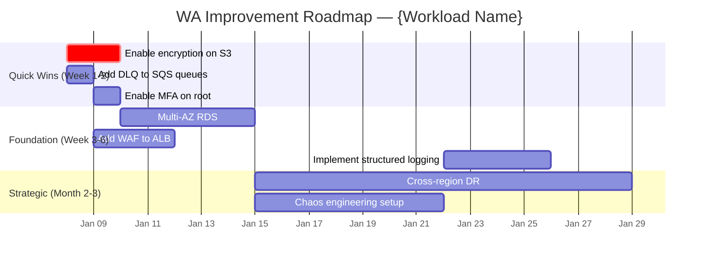

# Diagram Templates for WA Builder

## PlantUML Architecture Diagram Template

```plantuml
@startuml wa-architecture
!define AWSPuml https://raw.githubusercontent.com/awslabs/aws-icons-for-plantuml/v18.0/dist
!include AWSPuml/AWSCommon.puml
!include AWSPuml/Compute/Lambda.puml
!include AWSPuml/Database/DynamoDB.puml
!include AWSPuml/NetworkingContentDelivery/CloudFront.puml
!include AWSPuml/ApplicationIntegration/APIGateway.puml
!include AWSPuml/SecurityIdentityCompliance/IAMIdentityCenter.puml

title {Workload Name} — Well-Architected Health

' === PILLAR HEALTH LEGEND ===
legend right
  |= Color |= Meaning |
  | <#28a745> | Healthy (3+ score) |
  | <#ffc107> | Needs attention (2-3 score) |
  | <#dc3545> | Critical gaps (<2 score) |
endlegend

' === COMPONENTS ===
' Color each component by its lowest-scoring pillar

CloudFront(cdn, "CloudFront", "Content delivery") #28a745
APIGateway(api, "API Gateway", "REST/HTTP API") #ffc107
Lambda(fn, "Lambda Functions", "Business logic") #28a745
DynamoDB(db, "DynamoDB", "Data store") #28a745

' === RELATIONSHIPS ===
cdn --> api : HTTPS
api --> fn : invoke
fn --> db : read/write

' === ANNOTATIONS ===
note right of api
  **Security**: SEC 5 gap
  No WAF configured
  **Risk**: High
end note

note right of fn
  **Reliability**: REL 11
  No DLQ on async invoke
  **Risk**: Medium
end note

@enduml
```

## Mermaid Decision Tree Template

```mermaid
flowchart TD
    START[Your workload: {name}] --> Q1{"{Decision question based on gap}"}
    Q1 -->|"{condition A}"| OPTION_A["{Recommendation A}\n• {detail}\n• BP: {BP_ID}\nEffort: {Low/Med/High}\nCost: {impact}"]
    Q1 -->|"{condition B}"| Q2{"{Follow-up question}"}
    Q2 -->|"{condition C}"| OPTION_B["{Recommendation B}\n• {detail}\n• BP: {BP_ID}"]
    Q2 -->|"{condition D}"| OPTION_C["{Recommendation C}\n• {detail}"]
    
    style OPTION_A fill:#28a745,color:white
    style OPTION_B fill:#ffc107
    style OPTION_C fill:#17a2b8,color:white
```

## Mermaid Gantt Roadmap Template



## ASCII Dependency Graph Template

```
IMPROVEMENT DEPENDENCY GRAPH
============================

[Enable encryption] ─────────┐
     │                        │
     ▼                        ▼
[KMS key rotation] ────► [Cross-region replication]
                              │
[Add CloudWatch alarms] ─────┤
     │                        │
     ▼                        ▼
[Composite alarms] ────► [Automated remediation]

Legend:
  ───► = "must complete before"
  [RED text]    = Critical/High severity
  [YELLOW text] = Medium severity
  [GREEN text]  = Low severity / enhancement
```

## Pillar Health Scorecard Template

```markdown
## Pillar Scorecard

| Pillar | Score | Status | Key Strength | Top Gap |
|--------|-------|--------|--------------|---------|
| Operational Excellence | {1-5}/5 | {🟢🟡🔴} | {strength} | {gap} |
| Security | {1-5}/5 | {🟢🟡🔴} | {strength} | {gap} |
| Reliability | {1-5}/5 | {🟢🟡🔴} | {strength} | {gap} |
| Performance Efficiency | {1-5}/5 | {🟢🟡🔴} | {strength} | {gap} |
| Cost Optimization | {1-5}/5 | {🟢🟡🔴} | {strength} | {gap} |
| Sustainability | {1-5}/5 | {🟢🟡🔴} | {strength} | {gap} |

Scoring: 🟢 = 4-5 (Healthy) | 🟡 = 2-3 (Needs attention) | 🔴 = 1 (Critical gaps)
```
